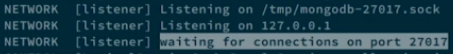
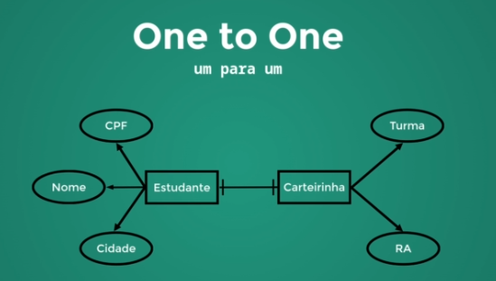
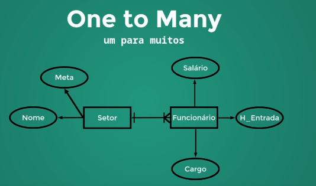
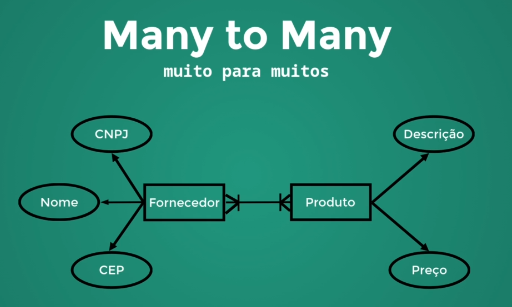

## Descrição

Este repositório contém materiais e projetos relacionados aos meus estudos de MongoDB ministrado pelo professor **Renan Pallin**. Aqui, você encontrará exemplos de código, anotações e exercícios práticos que abrangem desde os conceitos básicos até tópicos avançados. O objetivo é consolidar o aprendizado e aplicar as melhores práticas no uso do MongoDB.

## Andamento do Curso


- [x] Seção 1: [Introdução](#seção-1---introdução)
- [x] Seção 2: [Instalação](#seção-2---instalando-mongodb)
- [x] Seção 3: [Básico](#seção-3---básico)
- [x] Seção 4: [CRUD](#seção-4---crud)
- [x] Seção 5: [Modelagem e Relacionamentos](#seção-4---modelagem-e-relacionamentos)
- [x] Seção 6: [Schema e Validação](#seção-5---schema-e-validation)
- [ ] Seção 7: Algumas preparações para as consultas
- [ ] Seção 8: Consultas! Vamos buscar nossos dados!
- [ ] Seção 9: Consultas | Combinando operadores e se aprofundando
- [ ] Seção 10: Atualizações
- [ ] Seção 11: Atualização de Arrays
- [ ] Seção 12: Índices
- [ ] Seção 13: Índices | Laboratório de performance
- [ ] Seção 14: Agregação
- [ ] Seção 15: Agregação Netflix

---

# Seção 1 - Introdução

## **O que é o MongoBD ?**

MongoDB é um banco de dados NoSQL, orientado a documentos, que armazena informações no formato de documentos JSON (JavaScript Object Notation). Ao contrário dos bancos de dados relacionais que usam tabelas e linhas, o MongoDB utiliza uma estrutura flexível de dados, permitindo armazenar diferentes tipos de informações dentro de um mesmo documento. É
conhecido por sua escalabilidade e flexibilidade, sendo ideal para aplicações que lidam com grandes volumes de dados e precisam de rápida recuperação de informações.

## Um pouco da história dos bancos de dados

Os bancos de dados surgiram nos anos 1960 com sistemas baseados em arquivos, evoluindo para bancos relacionais nos anos 1970, que utilizam tabelas e colunas para organizar dados. Com o crescimento das necessidades de armazenamento e processamento, surgiram os bancos de dados NoSQL, como o MongoDB. O MongoDB organiza os dados usando **collections** (coleções) e **documents** (documentos), onde cada documento é um registro flexível no formato JSON. Isso permite armazenar informações complexas e com diferentes esquemas dentro de uma mesma coleção.


# Seção 2 - Instalando MongoDB

#### Windows:

1. Execute o instalador .msi.
2. Marque a opção "Complete" para instalação completa.
3. Opte por instalar como serviço (opção recomendada) e defina o diretório padrão de dados (C:\Program Files\MongoDB\Server\<versão>).
4. Finalize a instalação.

# Seção 3 - Básico

No MongoDB, podemos facilmente criar bancos de dados, coleções e visualizar suas estruturas com alguns comandos básicos. Vamos explorar como iniciar o serviço MongoBD na nossa maquina e realizar essas operações usando exemplos práticos.

## Iniciando o MongoDB

Uma vez instalado o programa na máquina, devemos agora iniciar o serviço do MongoDB. Com o terminal do windows aberto ou no terminal do VSCode, digite:

    mongo

Muito provavelmente se você acabou de instalar o mongoDB, verá uma tela de log com algumas informações e um aviso de falha na conexão. Isso ocorre porque o comando `mongo` que representa um cliente (usuário que quer consumir os seviços MongoDB), tenta por padrão, se conectar ao serviços do banco de dados no servidor MongoDB local (seu computador) por meio da `String de conexão`

    mongo://127.0.0.1:27017

onde o `127.0.0.1` representa o computador que estamos usando (localhost) e o `27017` é a porta padrão no qual o mongo tenta se conectar. Ao tentar a conexão, como não existe nenhum servidor do MongoDB rodando em seu computador (ainda), nos é retornado o erro.

Se ao contrário do que fizemos anteriormente, tentarmos iniciar o servidor MongoDB( responsável pelas funcinalidades do programa) na nossa máquina digitando no terminal o comando (que representa o servidor):

    mongod

também teremos um error, que agora ocorre pois não existe um **path** apontando para o diretório `/data/db`, que é o caminho dentro da nossa máquina onde o servidor mongoDB armazena os dados que adicionaremos dentro de nossas modelagens e aplicações.

Para resolver esse problema precisamos criar, caso ela não exista, a pasta `data` no seu computador. Pode ser em qualquer camminho dentro de sua máquina, porém o mongo sempre opta por criar na raiz `C:/` dentro do windows e você pode manter esse padrão se quiser, é o que farei aqui. Para isso no terminal, digite:

    mkdir data

onde `mkdir` é o comando dentro do windows que usamos para criar uma nova pasta e o `data` é o nome da pasta. Importante destacar é preciso estar atento ao caminho mostrado no terminal. Se eu digitasse o código abaixo no terminal:


a pasta `data` seria criada dentro de `C:\users\Igor\Documentos\Repositórios\MongoDB`, e isso não é o que queremos. Para isso usamos o comando

    cd..

para descer os níveis dentro do diretório, de modo que no usando `cd..` no caminho mostrado acima teriamos:

    C:\users\Igor\Documentos\Repositórios

fazendo isso continuamente, chagariamos em na raiz `C:`, nesse caminho usamos o `mkdir`.

Feito isso teremos uma pasta criada na raiz, e agora mostraremos ao mongo onde ela está usando o comando:

    mongod --dbpath C:\data

quando clicar no `enter`, será mostrado muitos logs onde um deles nos mostra que o servidor mongo foi iniciado e está esperando por conexões na porta padrão.



Agora se voltarmos ao terminal e digitarmos:

    mongo

novamente, teremos acesso a todos os serviços do MongoDB.

Para facilitar o entendimento do que foi explicado acima, veja a imagem abaixo e leia a descrição da imagem.


- **Mongod**:

  - **O mongod** é o servidor do MongoDB. Ele é responsável por gerenciar a base de dados, armazenar os dados, processar operações de leitura e escrita e lidar com a comunicação com o cliente.
  - O mongod precisa estar em execução para que qualquer operação no banco de dados ocorra. Ele escuta conexões na porta padrão (27017) ou outra especificada.

- **Mongo**:

  - O **mongo** é um cliente de linha de comando que se conecta ao mongod.
  - Através do cliente `mongo`, você pode interagir com o servidor para executar comandos como criar bancos de dados, visualizar coleções, consultar documentos, e assim por diante.
  - Ele atua como uma interface para enviar instruções ao mongod e obter respostas.

## Criar Banco de Dados no MongoDB

Diferente de bancos relacionais, onde criamos uma tabela que fica na base de dados até que algum dado seja adicionado nela, no MongoDB isso não acontence, pois o banco de dados só é criado no momento em que adicionamos um dado a ele. Para criar um BD no MongoDB, digitamos no CMD

# Seção 4 - CRUD

- [Introdução](#introdução)
- [1. Create (Inserir)](#1-create-inserir)
  - [Estrutura básica do comando](#estrutura-básica-do-comando)
  - [Exemplo de uso do `insert()`](#exemplo-de-uso-do-insert)
- [2. Read (Ler)](#2-read-ler)
  - [Estrutura básica do comando](#estrutura-básica-do-comando-1)
  - [Operadores de Comparação no MongoDB](#operadores-de-comparação-no-mongodb)
  - [Exemplo de uso do `find()`](#exemplo-de-uso-do-find)
  - [Usando `find()` com operadores](#usando-find-com-operadores)
  - [Projections (Projeções)](#projections)
- [3. Update (Atualizar)](#3-update-atualizar)
  - [Estrutura básica do comando](#estrutura-básica-do-comando-2)
  - [Operadores de Atualização no MongoDB](#operadores-de-atualização-no-mongodb)
  - [Exemplos de uso do update no MongoDB](#exemplos-de-uso-do-update-no-mongodb)
- [4. Delete (Remover)](#4-delete-remover)
  - [Estrutura básica do comando](#estrutura-básica-do-comando-3)
  - [Exemplos de uso do `delete()`](#exemplos-de-uso-do-delete-no-mongodb)
  - [Exemplo de remoção de collections com `drop()`](#exemplo-de-remoção-de-collections-com-drop)

## Introdução

No MongoDB, CRUD é um acrônimo que representa as operações básicas de manipulação de dados:

- **Create (Criar)**: Insere novos documentos em uma coleção.
- **Read (Ler)**: Consulta e recupera documentos existentes.
- **Update (Atualizar)**: Modifica dados de documentos existentes.
- **Delete (Excluir)**: Remove documentos de uma coleção.

Essas operações permitem gerenciar e interagir com os dados no banco de forma completa, além disso elas
possuem variações que podem ser aplicadas para documentos únicos ou múltiplos como visto na tabela e exemplos
abaixo.

| Operação | Único         | Múltiplos      |
| -------- | ------------- | -------------- |
| Create   | `insertOne()` | `insertMany()` |
| Read     | `findOne()`   | `find()`       |
| Update   | `updateOne()` | `updateMany()` |
| Delete   | `deleteOne()` | `deleteMany()` |

Comandos unicos são usados para atuar sobre documentos únicos, enquanto os múltiplos são usados para
atuar sobre multiplos documentos de uma vez só. Vejamos como usar esses métodos para manipular nosso bando de dados.

## Aviso ⚠️

Nos comandos abaixo, toda vez que encontrar a palavra "collection" após o comando "db" nos exemplos, você deve substituí-la pelo nome da coleção na qual você quer manipular.

---

## 1. **Create (Inserir)**

A operação `insert` adiciona novos documentos a uma coleção.

### **Estrutura básica do comando**

```javascript
db.collection.insert({ key: value });
```

### **Exemplo de uso do `insert()`**

- **`insertOne()`**: Insere um único documento.

  ```javascript
  db.collection.insertOne({ nome: "João", idade: 30, cidade: "São Paulo" });
  ```

- **`insertMany()`**: Insere múltiplos documentos.

  ```javascript
  db.collection.insertMany([
    { nome: "Maria", idade: 25, cidade: "Rio de Janeiro" },
    { nome: "Carlos", idade: 28, cidade: "Belo Horizonte" },
  ]);
  ```

  Ao executar os comandos acima, os itens serão inseridos no banco de dados. Agora vamos aprender a recuperar dados para que possamos visualizar as inserções de dados.

## 2. Read (Ler)

A operação `find` é usada para ler e recuperar documentos de uma coleção com base em critérios de pesquisa.

### **Estrutura básica do comando**

```javascript
db.collection.find(<filtro>, <projeção>)
```

- `<filtro>`: Especifica quais campos devem ser incluídos ou excluídos (opcional)
- `<projeção>`: Especifica quais campos devem ser incluídos ou excluídos (opcional) (Leia sobre Projeção [Aqui](#projections))

Antes de continuar entendendo como usamos o método `find()`, precisamos conhecer alguns operadores que podem ser utilizados para filtrar as buscas no banco.

### **Operadores de Comparação no MongoDB**

| **Operador** | **Descrição**                                                                              | **Exemplo de Uso**                                |
| ------------ | ------------------------------------------------------------------------------------------ | ------------------------------------------------- |
| `$eq`        | Seleciona documentos onde o campo é igual a um valor específico.                           | `{ idade: { $eq: 25 } }`                          |
| `$ne`        | Seleciona documentos onde o campo **não** é igual a um valor.                              | `{ idade: { $ne: 25 } }`                          |
| `$gt`        | Seleciona documentos onde o campo é maior que um valor.                                    | `{ idade: { $gt: 30 } }`                          |
| `$gte`       | Seleciona documentos onde o campo é maior ou igual a um valor.                             | `{ idade: { $gte: 30 } }`                         |
| `$lt`        | Seleciona documentos onde o campo é menor que um valor.                                    | `{ idade: { $lt: 20 } }`                          |
| `$lte`       | Seleciona documentos onde o campo é menor ou igual a um valor.                             | `{ idade: { $lte: 20 } }`                         |
| `$in`        | Seleciona documentos onde o campo possui um valor contido em uma lista.                    | `{ idade: { $in: [20, 25, 30] } }`                |
| `$nin`       | Seleciona documentos onde o campo **não** possui um valor contido em uma lista.            | `{ idade: { $nin: [20, 25, 30] } }`               |
| `$exists`    | Seleciona documentos onde o campo especificado existe (`true`) ou não existe (`false`).    | `{ sobrenome: { $exists: true } }`                |
| `$type`      | Seleciona documentos onde o campo possui um tipo de dado específico (ex: `string`, `int`). | `{ idade: { $type: "int" } }`                     |
| `$regex`     | Seleciona documentos onde o valor do campo corresponde a uma expressão regular (regex).    | `{ nome: { $regex: "^Igor", $options: "i" } }`    |
| `$size`      | Seleciona documentos onde um campo de array possui um tamanho específico.                  | `{ cursos: { $size: 3 } }`                        |
| `$all`       | Seleciona documentos onde um campo de array contém todos os elementos especificados.       | `{ tags: { $all: ["React", "Node"] } }`           |
| `$elemMatch` | Seleciona documentos onde pelo menos um elemento em um array corresponde a uma condição.   | `{ notas: { $elemMatch: { $gte: 8, $lt: 10 } } }` |

### **Exemplo de uso do `find()`**

- **`FindOne()`**: Busca um único documento

  ```javascript
  db.collection.findOne({ nome: "João" });
  ```

- **`Find()`**: Busca múltiplos documentos

  ```javascript
  db.collection.find({ idade: 25 });
  ```

### Usando `find()` com operadores.

- `$eq` (igual a)

  ```javascript
  db.collection.find({ idade: { $eq: 25 } });
  ```

  _Seleciona documentos onde a idade é exatamente 25._

- `$ne` (não igual a)

  ```javascript
  db.collection.find({ idade: { $ne: 25 } });
  ```

  _Seleciona documentos onde a idade não é 25._

- `$gt` (maior que)

  ```javascript
  db.collection.find({ idade: { $gt: 30 } });
  ```

  _Seleciona documentos onde a idade é maior que 30._

- `$gte` (maior ou igual a)

  ```javascript
  db.collection.find({ idade: { $gte: 30 } });
  ```

  _Seleciona documentos onde a idade é maior ou igual a 30._

- `$lt` (menor que)

  ```javascript
  db.collection.find({ idade: { $lt: 20 } });
  ```

  _Seleciona documentos onde a idade é menor que 20._

- `$lte` (menor ou igual a)

  ```javascript
  db.collection.find({ idade: { $lte: 20 } });
  ```

  _Seleciona documentos onde a idade é menor ou igual a 20._

- `$in` (dentro de um conjunto)

  ```javascript
  db.collection.find({ idade: { $in: [20, 25, 30] } });
  ```

  _Seleciona documentos onde a idade é 20, 25 ou 30._

- `$nin` (não dentro de um conjunto)

  ```javascript
  db.collection.find({ idade: { $nin: [20, 25, 30] } });
  ```

  _Seleciona documentos onde a idade não é 20, 25 ou 30._

- `$exists` (existe)

  ```javascript
  db.collection.find({ sobrenome: { $exists: true } });
  ```

  _Seleciona documentos onde o campo `sobrenome` existe._

- `$type` (tipo)

  ```javascript
  db.collection.find({ idade: { $type: "int" } });
  ```

  _Seleciona documentos onde o campo `idade` é do tipo inteiro._

- `$regex` (expressão regular)

  ```javascript
  db.collection.find({ nome: { $regex: "^Igor", $options: "i" } });
  ```

  _Seleciona documentos onde o campo `nome` começa com "Igor" (case-insensitive)._

- `$size` (tamanho de array)

  ```javascript
  db.collection.find({ cursos: { $size: 3 } });
  ```

  *Seleciona documentos onde o campo `cursos` possui exatamente 3 eleme*ntos.

- `$all` (contém todos os elementos especificados)

  ```javascript
  db.collection.find({ tags: { $all: ["React", "Node"] } });
  ```

  *Seleciona documentos onde o campo `tags` contém ambos os valores "Re*act" e "Node".

- `$elemMatch` (correspondência dentro de um array)

  ```javascript
  db.collection.find({ notas: { $elemMatch: { $gte: 8, $lt: 10 } } });
  ```

  _Seleciona documentos onde pelo menos um elemento no array `notas` é maior ou igual a 8 e menor que 10._

## Projections

No MongoDB, projections são usadas para especificar quais campos de um documento devem ser incluídos ou excluídos nos resultados de uma consulta. Em outras palavras, as projeções permitem que você controle exatamente quais partes dos documentos serão retornadas, melhorando a performance ao evitar o retorno de dados desnecessários.

A seleção dos campos que serão exibidos na busca é feita utilizando **0 / false** para ocultar um campo e **1 / true** para exibi-lo. Veja o exemplo abaixo e o resultado da busca:

```javascript
db.collection.find(
  { name: "Aline" },
  { _id: 0, name: 1, idade: 1, sobrenome: 0 }
);
```

Na query acima, buscamos os documentos que contenham o nome "Aline" dentro de nossa base, selecionando os campos `name`, `idade` para serem mostrados e o `_id` e `sobrenome` para serem ocultados no retorno. Se existirem documentos dentro da base como:


o resultado do busca com o uso do projection mostrado acima será:


## 3. Update (atualizar)

Usamos o método update para atualizar dados já inseridos dentro da base, para isso usamos o `updateOne()` ou o `updateMany()`, que pode ser usado simplesmente como `update()`.

### **Estrutura básica do comando**

```javascript
db.collection.update( <filtro>, <atualização> ,<opções> )
```

- `<Filtro>`: Critério para selecionar o(s) documento(s)
- `<atualização>`: Especifica as alterações a serem feitas

* `<opções>`: Parâmetros opcionais, como `upsert` ou `multi`

Para entendermos bem como usar o **update** no mongoDB, precisamos conhecer primeiro alguns operadores de atualização do mongoDB. Na tabela abaixo podemos ver quais são eles, uma breve descrição sobre como atuam e um exemplo de como usá-los.

### **Operadores de Atualização no MongoDB**

| **Operador**   | **Descrição**                                                                                  | **Exemplo de Uso**                            |
| -------------- | ---------------------------------------------------------------------------------------------- | --------------------------------------------- |
| `$set`         | Define o valor de um campo existente ou adiciona um novo campo.                                | `{ $set: { idade: 28 } }`                     |
| `$unset`       | Remove um campo do documento.                                                                  | `{ $unset: { sobrenome: "" } }`               |
| `$inc`         | Incrementa o valor de um campo numérico.                                                       | `{ $inc: { idade: 1 } }`                      |
| `$rename`      | Renomeia um campo no documento.                                                                | `{ $rename: { "sobrenome": "ultimoNome" } }`  |
| `$setOnInsert` | Define o valor de um campo **somente** quando um novo documento é criado (usado com `upsert`). | `{ $setOnInsert: { cidade: "São Paulo" } }`   |
| `$push`        | Adiciona um valor a um array.                                                                  | `{ $push: { notas: 9 } }`                     |
| `$pop`         | Remove o primeiro ou o último elemento de um array (`1` para o último, `-1` para o primeiro).  | `{ $pop: { notas: 1 } }`                      |
| `$pull`        | Remove do array todos os elementos que atendem a uma condição especificada.                    | `{ $pull: { notas: { $lt: 5 } } }`            |
| `$addToSet`    | Adiciona um valor a um array, mas somente se ele ainda não estiver presente.                   | `{ $addToSet: { cursos: "React" } }`          |
| `$currentDate` | Define um campo com a data e hora atuais.                                                      | `{ $currentDate: { dataAtualizacao: true } }` |
| `$max`         | Atualiza o campo apenas se o valor especificado for maior que o valor atual.                   | `{ $max: { idade: 30 } }`                     |
| `$min`         | Atualiza o campo apenas se o valor especificado for menor que o valor atual.                   | `{ $min: { idade: 20 } }`                     |

### **Exemplos de uso do update no MongoDB**

- **`UpdateOne`**: Atualiza um único documento

  ```javascript
  db.collection.updateOne({ name: "Aline" }, { $set: { idade: 28 } });
  ```

* **`UpdateMany()`**: Atualiza **todos** os documentos que correspondem ao filtro

  ```javascript
  db.collection.updateMany({ name: "Aline" }, { $set: { idade: 28 } });
  ```

  Usando os métodos acima podemos ainda fazer outros tipo de atualizações, como remover, renomear, incremanentar e etc

* **Remover campos**
  ```javascript
  db.collection.updateMany(
    { idade: { $gte: 25 } },
    { $unset: { sobrenome: "" } }
  );
  ```
* **Renomear um Campo**
  ```javascript
  db.collection.updateMany({}, { $rename: { sobrenome: "ultimoNome" } });
  ```
* **Atualização com upsert**  
   Se não existir um documento onde name seja "Igor", cria um novo documento com `idade: 30`.

  ```javascript
  db.collection.updateOne(
    { name: "Igor" },
    { $set: { idade: 30 } },
    { upsert: true }
  );
  ```

* **Adicionar um Campo Se Não Existir ($setOnInsert)**  
  Usa o `upsert` para adicionar o campo cidade apenas quando um novo documento for inserido.

  ```javascript
  db.collection.updateOne(
    { name: "Aline" },
    { $setOnInsert: { cidade: "São Paulo" } },
    { upsert: true }
  );
  ```

Importante destacar que todos os exemplos e operadores mostrados acima podem ser usados tantos com `updateOne` quando com o `updateMany`.

## 3. Delete (Remover)

Usamos o método `delete` para remover documentos de uma coleção. Existem duas formas principais para remover documentos: `deleteOne()` e `deleteMany()`, que funcionam de maneira semelhante ao `remove()`.

### **Estrutura básica do comando**

```javascript
db.collection.delete( <filtro> ,<opções> )
```

- `<filtro>`: Critério para selecionar o(s) documento(s) a serem removidos.
- `<opções>`: Parâmetros opcionais que podem modificar o comportamento da remoção, como writeConcern (confirmação de gravação) e collation (regras de comparação).

### Exemplos de uso do delete no MongoDB

- `deleteOne()`: Remove um único documento que corresponde ao filtro especificado.

  ```javascript
  db.collection.deleteOne({ name: "Igor" });
  ```

  Esse comando remove apenas o primeiro documento que satisfaz o critério `{ name: "Igor" }`.

- `deleteMany()`: Remove todos os documentos que correspondem ao filtro.

  ```javascript
  db.collection.deleteMany({ cidade: "São Paulo" });
  ```

### Exemplos de uso do delete com [Operadores](#operadores-de-comparação-no-mongodb)

- `DeleteMany()` com campo e condição

  ```javascript
  db.collection.deleteMany({ idade: { $gt: 30 } });
  ```

Podemos usar qualquer um dos operadores mostrados na tabela de operadores acima no método `delete`

Usamos o comando `delete` a nivel de documentos. Como fazemos então para remover uma **collection** inteira de uma vez só da base de dados? Para isso usamos o `drop()`!

## Aviso ⚠️

Os comandos de deletar devem ser usados com cautela, pois uma vez removido os documentos e collections não é possível recuperá-los.

---

### Exemplo de remoção de collections com `drop()`

```javascript
// Remove a coleção chamada "users"
db.users.drop();
```

- No exemplo acima, a coleção users será completamente removida do banco de dados, incluindo todos os documentos e o esquema associado a ela.
- Se a coleção não existir, o comando `drop()` retornará **false**. Caso a coleção exista e seja removida com sucesso, o comando retornará **true**.

# Seção 4 - Modelagem e Relacionamentos

No MongoDB, a modelagem de dados e os relacionamentos entre documentos são conceitos fundamentais para se construir uma aplicação eficiente e performática. Ao contrário dos bancos de dados relacionais, que utilizam tabelas e chaves estrangeiras para estabelecer relações, o MongoDB adota um modelo de dados flexível, baseado em documentos, que oferece diversas abordagens para representar relacionamentos. Essa flexibilidade permite que os dados sejam modelados de acordo com as necessidades específicas de cada aplicação, promovendo consultas mais rápidas e uma estrutura mais fácil de ser evoluída.

## Por que Modelagem é Importante?

Modelar dados corretamente é essencial para garantir a performance e a escalabilidade de uma aplicação. Um bom design de esquema evita consultas pesadas, otimiza o uso de memória e simplifica a manutenção da base de dados. Por isso, a escolha de como armazenar e relacionar documentos depende de entender os tipos de operações que serão realizadas e o comportamento esperado dos dados.

## Tipos de Relacionamentos no MongoDB

Embora não possua chaves estrangeiras como bancos relacionais, o MongoDB suporta diferentes tipos de relacionamentos usando **referências** (referencing) ou **embutimento** (embedding). Os principais tipos são:

1. **Relação Um-para-Um** (1:1)

- Um documento A está relacionado a apenas um documento B e vice-versa.
- **Exemplos**: Estudante e carteirinha são documentos que compartilham uma identificação única.

  

2.  **Relação um-para-Muitos** (1)

- Um documento A está relacionado a muitos documentos B.
- **Exemplos**: Setor e funcionários de uma empresa.

  

3. **Relação Muitos-para-Muitos(N)**

- Muitos documentos A estão relacionados a muitos documentos B.
- **Exemplos**: Fornecedor e produto

  

### Modelagem de Relacionamentos

No MongoDB, as estratégias de modelagem se dividem em duas abordagens principais:

1. **Embutimento (Embedding)**

- Os dados relacionados são armazenados dentro de um mesmo documento.
- É indicado para relacionamentos estreitamente ligados, onde os dados geralmente são recuperados juntos.
- **Vantagem**: Acesso rápido, pois todos os dados estão em um único documento.
- **Desvantagem**: Pode levar à duplicação de dados e documentos grandes demais.

```javascript
{
  "_id": 1,
  "cliente": "Maria",
  "itens": [
    { "produto": "Notebook", "quantidade": 1, "preco": 1500 },
    { "produto": "Mouse", "quantidade": 1, "preco": 50 }
  ]
}
```

2. **Referenciamento (Referencing)**

- Os dados relacionados são armazenados em documentos separados e referenciados por meio de IDs.
- É indicado para relacionamentos mais complexos ou onde o tamanho do documento pode crescer de forma descontrolada.
- **Vantagem**: Permite uma estrutura mais modular e flexível.
- **Desvantagem**: Pode exigir múltiplas consultas (lookup) para agregar os dados

```javascript
// Documento Cliente
{
  "_id": 1,
  "nome": "Maria",
  "pedidos": [1001, 1002]
}

// Documento Pedido
{
  "_id": 1001,
  "itens": [
    { "produto": "Notebook", "quantidade": 1, "preco": 1500 }
  ]
}
```

# Seção 5 - Schema e Validation

O MongoDB é um banco de dados NoSQL, conhecido por sua flexilibilidade na adição de documentos com diferentes formatos em diferentes coleções. Essa flexibilidade pode levar a inconsistências caso não haja nenhum tipo de controle dos dados que estão sendo inseridos no banco. Pensando justamente em solucionar esse problema, o MongoDB introduziu o conceito de **Schema Validation**, que nos permite definir regras que garatam a integridade dos dados.

## O que é um Schema?

No contexto do MongoDB, um **schema** é um conjunto de regras e restrições que define como os documentos devem ser estruturados em uma coleção. Ele especifica quais campos são obrigatórios, os tipos de dados permitidos, restrições nos valores e até mesmo o formato dos dados, garantindo que cada documento inserido ou atualizado atenda a esses critérios.

Com o **Schema validation** podemos:

- **Definir tipos de dados**: Garantir que um campo dentro de um documento sejá `String`, `number`, `boolean` e etc.

- **Estabelecer campos obrigatórios**: Definir quais campos devem estar obrigatóriamente presentes nos documentos

- **Restringir valores**: Por exemplo, validar que um idade seja maior que zero.

- **Validar estruturas complexas**: Como validar arrays ou subdocumentos

## Como utilizar o Schema Validation

<!--
```javascript
db.createCollection("students", {
   validator: {
      $jsonSchema: {
         bsonType: "object",
         title: "Student Object Validation",
         required: [ "address", "major", "name", "year" ],
         properties: {
            name: {
               bsonType: "string",
               description: "'name' must be a string and is required"
            },
            year: {
               bsonType: "int",
               minimum: 2017,
               maximum: 3017,
               description: "'year' must be an integer in [ 2017, 3017 ] and is required"
            },
            gpa: {
               bsonType: [ "double" ],
               description: "'gpa' must be a double if the field exists"
            }
         }
      }
   }
} )
``` -->


