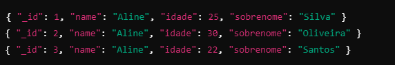
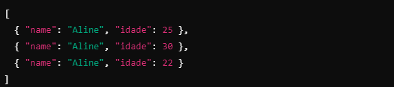

## Descrição

Este repositório contém materiais e projetos relacionados aos meus estudos de MongoDB ministrado pelo professor **Renan Pallin**. Aqui, você encontrará exemplos de código, anotações e exercícios práticos que abrangem desde os conceitos básicos até tópicos avançados. O objetivo é consolidar o aprendizado e aplicar as melhores práticas no uso do MongoDB.

## Andamento do Curso


- [x] Seção 1: [Introdução](#seção-1---introdução)
- [x] Seção 2: [Instalação](#seção-2---instalando-mongodb)
- [ ] Seção 3: [Básico](#seção-3---básico)
- [ ] Seção 4: [CRUD](#seção-4---crud)
- [ ] Seção 5: Modelagem e Relacionamentos
- [ ] Seção 6: Schema e Validação
- [ ] Seção 7: Algumas preparações para as consultas
- [ ] Seção 8: Consultas! Vamos buscar nossos dados!
- [ ] Seção 9: Consultas | Combinando operadores e se aprofundando
- [ ] Seção 10: Atualizações
- [ ] Seção 11: Atualização de Arrays
- [ ] Seção 12: Índices
- [ ] Seção 13: Índices | Laboratório de performance
- [ ] Seção 14: Agregação
- [ ] Seção 15: Agregação Netflix

---

### Seção 1 - Introdução

1. **O que é o MongoBD ?**

   MongoDB é um banco de dados NoSQL, orientado a documentos, que armazena informações no formato de documentos JSON (JavaScript Object Notation). Ao contrário dos bancos de dados relacionais que usam tabelas e linhas, o MongoDB utiliza uma estrutura flexível de dados, permitindo armazenar diferentes tipos de informações dentro de um mesmo documento. É
   conhecido por sua escalabilidade e flexibilidade, sendo ideal para aplicações que lidam com grandes volumes de dados e precisam de rápida recuperação de informações.

2. **Um pouco da história dos bancos de dados**

   Os bancos de dados surgiram nos anos 1960 com sistemas baseados em arquivos, evoluindo para bancos relacionais nos anos 1970, que utilizam tabelas e colunas para organizar dados. Com o crescimento das necessidades de armazenamento e processamento, surgiram os bancos de dados NoSQL, como o MongoDB. O MongoDB organiza os dados usando **collections** (coleções) e **documents** (documentos), onde cada documento é um registro flexível no formato JSON. Isso permite armazenar informações complexas e com diferentes esquemas dentro de uma mesma coleção.


### Seção 2 - Instalando MongoDB

#### Windows:

1. Execute o instalador .msi.
2. Marque a opção "Complete" para instalação completa.
3. Opte por instalar como serviço (opção recomendada) e defina o diretório padrão de dados (C:\Program Files\MongoDB\Server\<versão>).
4. Finalize a instalação.

### Seção 3 - Básico

### Seção 4 - CRUD

No MongoDB, CRUD é um acrônimo que representa as operações básicas de manipulação de dados:

- Create (Criar): Insere novos documentos em uma coleção.
- Read (Ler): Consulta e recupera documentos existentes.
- Update (Atualizar): Modifica dados de documentos existentes.
- Delete (Excluir): Remove documentos de uma coleção.

Essas operações permitem gerenciar e interagir com os dados no banco de forma completa, além disso elas
possuem variações que podem ser aplicadas para documentos únicos ou múltiplos como visto na tabela e exemplos
abaixo.

| Operação | Único         | Múltiplos      |
| -------- | ------------- | -------------- |
| Create   | `insertOne()` | `insertMany()` |
| Read     | `findOne()`   | `find()`       |
| Update   | `updateOne()` | `updateMany()` |
| Delete   | `deleteOne()` | `deleteMany()` |

Comandos unicos são usados para atuar sobre documentos únicos, enquanto os múltiplos são usados para
atuar sobre multiplos documentos de uma vez só.

### 1. **Create (Inserir)**

- **`insertOne()`**: Insere um único documento.

  ```javascript
  db.collection.insertOne({ nome: "João", idade: 30, cidade: "São Paulo" });
  ```

- **`insertMany()`**: Insere múltiplos documentos.

  ```javascript
  db.collection.insertMany([
    { nome: "Maria", idade: 25, cidade: "Rio de Janeiro" },
    { nome: "Carlos", idade: 28, cidade: "Belo Horizonte" },
  ]);
  ```

  Ao executar os comandos acima, os itens serão inseridos no banco de dados. Agora vamos aprender a recuperar dados para que possamos visualizar as inserções de dados.

### 2. Read (Ler)

- **`findOne`**: Busca um único documento

  ```javascript
  db.collection.findOne({ nome: "João" });
  ```

- **`Find()`**: Busca múltiplos documentos

  ```javascript
  db.collection.find({ idade: { $gte: 25 } });
  ```

  No último exemplo acima vemos o uso de operadores que, no **MongoDB**, são usados em operações que
  nos permitem filtrar as buscas entre intervalos(operadores de comparação), verificar se determinado campo existe(**operador de existência**) em algum documento dentro do banco e muitos outros que veremos com detalhes.

  ```javascript
  db.collection.find({ especial: { $exist: true } });
  ```

  no codigo acima, usando o operador operador de existência,
  buscamos pelo campo "especial", caso exista algum documento que atenda a busca ele será retornado como resultado.

  ***

  ### Projections

  No MongoDB, projections são usadas para especificar quais campos de um documento devem ser incluídos ou excluídos nos resultados de uma consulta. Em outras palavras, as projeções permitem que você controle exatamente quais partes dos documentos serão retornadas, melhorando a performance ao evitar o retorno de dados desnecessários.  
   Para usar projections e filtrar quais campos do documento queremos ver devemos usar a sintax abaixo:

  ```javascript
  db.collection.find({ query }, { projections });
  ```

  Onde a seleção dos campos que derão ser mostrados na busca será dada por **0 / false** para não mostrar determinado campo e **1 / true** para mostrar o campo. Vejam o exemplo abaixo e o resultado da busca:

  ```javascript
  db.collection.find(
    { name: "Aline" },
    { _id: 0, name: 1, idade: 1, sobrenome: 0 }
  );
  ```

  na query acima, buscamos os documentos que contenham o nome "Aline" dentro de nossa base, selecionando os campos `name`, `idade` para serem mostrados e o `_id` e `sobrenome` para serem ocultados no retorno. Se existirem documentos dentro da base como:

  

  o resultado do busca com o uso de projections será:

  

### 3. Update (atualizar)

Usamos o método update para atualizar dados já inseridos dentro da base, para isso usamos o `updateOne()` ou o `updateMany()`, que pode ser usado simplesmente como `update()`.

**Estrutura básica do comando**

```javascript
db.collection.update( <filtro>, <atualização> ,<opções> )
```

- `<Filtro>`: Critério para selecionar o(s) documento(s)
- `<atualização>`: Especifica as alterações a serem feitas \*`<opções>`: Parâmetros opcionais, como `upsert` ou `multi`

Para entendermos bem como usar o **update** no mongoDB, precisamos conhecer primeiro alguns operadores de atualização do mongoDB. Na tabela abaixo podemos ver quais são eles, uma breve descrição sobre como atuam e um exemplo de como usá-los.

**Operadores de Atualização no MongoDB**

| **Operador**   | **Descrição**                                                                                  | **Exemplo de Uso**                            |
| -------------- | ---------------------------------------------------------------------------------------------- | --------------------------------------------- |
| `$set`         | Define o valor de um campo existente ou adiciona um novo campo.                                | `{ $set: { idade: 28 } }`                     |
| `$unset`       | Remove um campo do documento.                                                                  | `{ $unset: { sobrenome: "" } }`               |
| `$inc`         | Incrementa o valor de um campo numérico.                                                       | `{ $inc: { idade: 1 } }`                      |
| `$rename`      | Renomeia um campo no documento.                                                                | `{ $rename: { "sobrenome": "ultimoNome" } }`  |
| `$setOnInsert` | Define o valor de um campo **somente** quando um novo documento é criado (usado com `upsert`). | `{ $setOnInsert: { cidade: "São Paulo" } }`   |
| `$push`        | Adiciona um valor a um array.                                                                  | `{ $push: { notas: 9 } }`                     |
| `$pop`         | Remove o primeiro ou o último elemento de um array (`1` para o último, `-1` para o primeiro).  | `{ $pop: { notas: 1 } }`                      |
| `$pull`        | Remove do array todos os elementos que atendem a uma condição especificada.                    | `{ $pull: { notas: { $lt: 5 } } }`            |
| `$addToSet`    | Adiciona um valor a um array, mas somente se ele ainda não estiver presente.                   | `{ $addToSet: { cursos: "React" } }`          |
| `$currentDate` | Define um campo com a data e hora atuais.                                                      | `{ $currentDate: { dataAtualizacao: true } }` |
| `$max`         | Atualiza o campo apenas se o valor especificado for maior que o valor atual.                   | `{ $max: { idade: 30 } }`                     |
| `$min`         | Atualiza o campo apenas se o valor especificado for menor que o valor atual.                   | `{ $min: { idade: 20 } }`                     |

**Comandos mais comuns no MongoDB**

- **`UpdateOne`**: Atualiza um único documento

  ```javascript
  db.collection.updateOne({ name: "Aline" }, { $set: { idade: 28 } });
  ```

* **`UpdateMany()`**: Atualiza **todos** os documentos que correspondem ao filtro

  ```javascript
  db.collection.updateMany({ name: "Aline" }, { $set: { idade: 28 } });
  ```

### 4. Delete (Deletar)

- **`DeleteOne`**: Deleta um único documento

  ```javascript
  db.collection.deleteOne({ nome: "João" });
  ```

- **`DeleteMany()`**: Atualiza múltiplos documentos

  ```javascript
  db.collection.deleteMany({ idade: { $lt: 30 } }); // Remove todos os usuários com idade menor que 30
  ```

  
